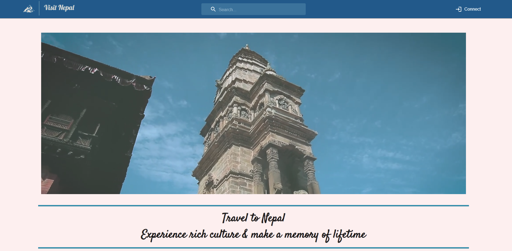
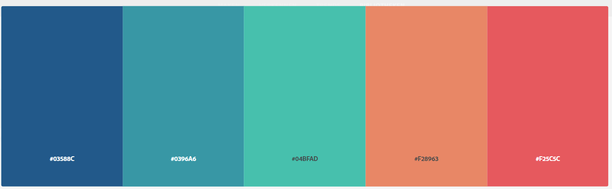
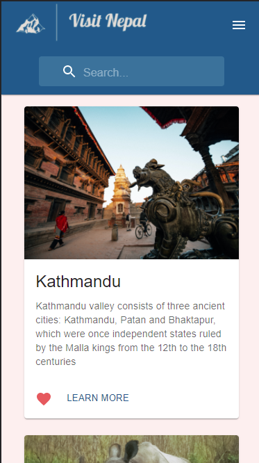
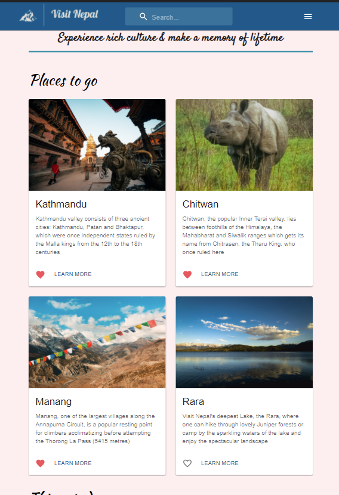
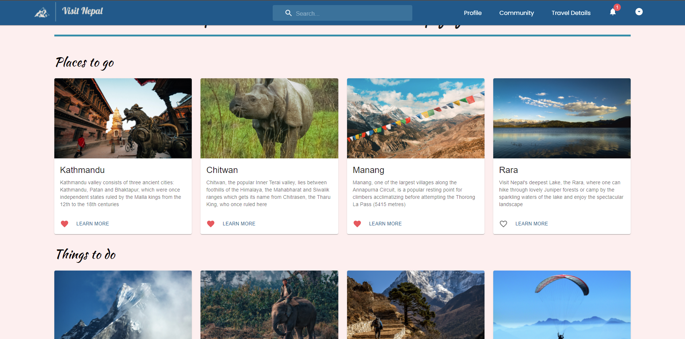

# Tourism Website

## Country: Nepal
Even though I have a Belgian Nationality, I am originally from Nepal. So, I wanted to create a website about Nepal to honor my childhood memories. 
## Color Palette
 
## Tools
- React 
- Material UI
- Firebase real-time database
- Deployment: Firebase hosting

## Things that are completed
### Home page
- Card information fetched from database
- Like/ unlike feature is authenticated
- One user can only access their own like/unlike list
- Articles can be read with and without logging in 
### Connect page
- Sign up and log in pages are completed with authentication
### Responsive layout
- Everything done so far has a responsive design that adapts to different screen sizes
- Below you can see example from home page for xs screens, sm screens and higher, and lg screens and higher

## Currently working on
### Profile page
- favorites list will be created
## Next 
- Searchbar
## Things I want to improve later
- Home page video
- keeping the card length same. Right now, in some cases, the card length fluctuates due to the different amount of words in each card
- Include password validation for connect page as well as improve other validations
## Links
- Logo from [Adobe logo-maker](https://express.adobe.com/express-apps/logo-maker/) 
- Pictures and Videos from [Pexels](https://www.pexels.com/)
- Information retrieved from [Official website of Nepal Tourism board](https://ntb.gov.np/)
### Information about: 
- Manang: [Insidehimalayas.com](https://www.insidehimalayas.com/why-you-need-visit-manang/)
- Shivaratri: [ruggedtrailsnepal.com](https://www.ruggedtrailsnepal.com/blog/shivaratri-in-nepal)
- Holi: [altitudehimalaya.com](https://www.altitudehimalaya.com/blog/holi-festival-in-nepal) 
### Disclaimer
This is a personal project for building my portfolio. If you wish to travel to Nepal and want correct information, check the official link mentioned above!!
